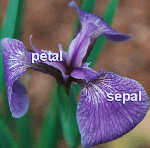

<style>body {text-align: justify}</style>

<center> <h1>MAE5776 - 1º Sem/2022</h1> </center>
<center> <h1>Análise Descritiva Multivariada</h1> </center>

<br>
```{r setup, include=FALSE}
knitr::opts_chunk$set(echo = TRUE)
options(scipen=999)

library(kableExtra)
library(tidyverse)
```

**Alunos:**

Fernando F. Paulos Vieira - nº USP: 13492870

Leandro Alves da Silva - nº USP: 11868023

Thiago Ferreira Miranda - nº USP: 11925711


Considere os dados “Iris” (Fisher, RA, 1936. The use of <span style="color:red">multiple measurements</span> in taxonomic problems. Annals of Eugenics 7, Part II: 179–188), com medidas do comprimento e largura da pétala e da sépala de 150 flores de íris, sendo 50 observações de cada uma das espécies setosa, versicolor e virginica. 

```{r plot_iris, echo=F,out.width="100px"}

```

**1. Discuta a estrutura destes dados:** variáveis resposta (quantas? quantitativas?), possíveis fatores sob estudo, tamanho amostral. Que objetivos poderiam ser de interesse no estudo?

**R:**

O banco de dados apresenta 1 variável resposta categórica, denominada Species e, 4 variáveis quantitativas (Petal.Length, Sepal.Length, Petal. Width, Sepal. Width).

Como possíveis fatores sob estudo temos as dimensões observadas de cada uma das variáveis quantitativas, características especificas por espécie e/ou tendências, bem como nível de dependência apresentadas por determinada variável (a depender ou não da espécie). Isso ao considerar um tamanho amostral de 165 observações.

Candidatados a objetivos de interesse no estudo poderíamos citar:

* Identificar quais espécie apresentam maiores e menores dimensionais;

* Verificar se existe correlação entre as dimensões de pétala e sépala de uma mesma espécie ou independente da espécie;

* Identificar o grau de pureza dos clusters, ou seja, se os grupos possuem “limites” com separações claras e bem definidas;

* E, quais variáveis possuem maior e menor variabilidade e se há diferença na análise das observações totais ou por grupo (espécie)

\newpage

**2.** Usando os recursos do R realize a **análise descritiva multivariada** desses dados:

Neste relatório utilizaremos a base iris com os dados incrementais, onde foram simuladas 15 novas observações, 5 para cada espécie de flor. Como incremento, levamos em conta o vetor de médias e a matriz de covariância das 150 observações originais. 

```{r}
iris_num <- iris %>% 
  select(Petal.Length,Sepal.Length,Petal.Width,Sepal.Width) 

iris_mean <- colMeans(iris_num)
iris_cov <- cov(iris_num)

set.seed(123) 
novas_observacoes <- MASS::mvrnorm(15,iris_mean,iris_cov) 
novas_observacoes <- novas_observacoes %>% 
  data.frame(Species = c(rep("setosa",5),rep("versicolor",5),rep("virginica",5)))
```

<br>

```{r echo=F}
novas_observacoes %>%
  kbl() %>%
  kable_classic_2(full_width = F)
```
<br>

**Vetor de Médias (Centróide)** para a amostra total e por grupo.


```{r echo=F}

iris_simulado <- bind_rows(iris,novas_observacoes)

medias_total <- iris_simulado %>% 
  summarise(`Petal.Length Y1` = mean(Petal.Length),
            `Sepal.Length Y2` = mean(Sepal.Length),
            `Petal.Width Y3` = mean(Petal.Width),
            `Sepal.Width Y4` = mean(Sepal.Width)) %>% 
  gather("key","Total (n=165)")

medias_grupo <- iris_simulado %>% 
  group_by(Species) %>% 
  summarise(`Petal.Length Y1` = mean(Petal.Length),
            `Sepal.Length Y2` = mean(Sepal.Length),
            `Petal.Width Y3` = mean(Petal.Width),
            `Sepal.Width Y4` = mean(Sepal.Width)) %>% 
  gather("key","value",-Species) %>% 
  spread(Species,value) %>% 
  setNames(paste(str_to_title(colnames(.)),"(n=55)"))

medias <- left_join(medias_total,medias_grupo,by=c("key"="Key (n=55)")) %>% 
  rename(" "="key")

medias %>%
  kbl() %>%
  kable_classic_2(full_width = F)%>%
  add_header_above(c(" " = 2, "G1" = 1,"G2" = 1,"G3" = 1))

```

<br>

Qual variável tem maior e menor média? 

**R:**

A variável Sepal.Length possui a maior média (ao considerarmos a amostra total e por grupo).
E a variável Petal.Width possui a menor média (ao considerarmos a amostra total e por grupo).

<br>

Qual flor de íris (espécie) parece ser maior que as demais?

**R:**

A espécie virginica parece ser maior, pois apresenta (na maior parte dos casos) maiores valores médios das dimensões observadas nas amostras por grupo, tendo em vista as 4 variáveis quantitativas avaliadas.

<br>

**Matriz de Covariância e Correlação:** $S_{T}$ (triangular superior) e $R_{T}$ (triangular inferior)

```{r echo=F}
iris_num <- iris_simulado %>% 
  select(Petal.Length,Sepal.Length,Petal.Width,Sepal.Width) %>% 
  setNames(c("Y1","Y2","Y3","Y4"))

iris_cov <- cov(iris_num)
iris_cor <- cor(iris_num)

matriz <- upper.tri(iris_cov, diag = TRUE)*iris_cov+lower.tri(iris_cor)*iris_cor
matriz %>% 
  #round(4) %>% 
  data.frame() %>% 
  rowid_to_column(var = "$R_{T} | S_{T}$")%>%
  mutate(`$R_{T} | S_{T}$` = paste0("Y",`$R_{T} | S_{T}$`)) %>% 
  kable(escape = F) %>%
  kable_classic_2(full_width = F) %>% 
  column_spec(2,background = c("lightgray", "white","white", "white")) %>% 
  column_spec(3,background = c("lightgray", "lightgray","white", "white")) %>% 
  column_spec(4,background = c("lightgray", "lightgray","lightgray", "white")) %>% 
  column_spec(5,background = c("lightgray", "lightgray","lightgray", "lightgray"))

```

Calcule a variância total e a variância generalizada:

**tr(S) =** `r sum(diag(iris_cov))`     **|S| =** `r det(iris_cov)`    

**tr(R) =** `r sum(diag(iris_cor))`     **|R| =** `r det(iris_cor)` 

<br>

Qual variável tem maior variabilidade? E qual tem a menor variabilidade?

**R:**

A variável Petal.Length(Y1) tem a maior variabilidade, enquanto a variável Sepal.Width(Y4) tem a menor variabilidade.

<br>

**3.** Quais variáveis estão mais correlacionadas?

Para o total das observações, independente da espécie, as variáveis Petal.Length(Y1) e Petal.Width(Y3) estão mais correlacionadas que as demais, com coeficiente de correlação de 0.96.

<br>

**Análise por espécie:**
```{r echo=F}
iris_num <- iris_simulado %>% 
  filter(Species=="setosa") %>% 
  select(Petal.Length,Sepal.Length,Petal.Width,Sepal.Width) %>%
  setNames(c("Y1","Y2","Y3","Y4"))
iris_cor <- cor(iris_num)
iris_cov <- cov(iris_num)

matriz <- upper.tri(iris_cov, diag = TRUE)*iris_cov+lower.tri(iris_cor)*iris_cor
matriz %>% 
  #round(4) %>% 
  data.frame() %>% 
  rowid_to_column(var = "Setosa $S_{1}$")%>%
  mutate(`Setosa $S_{1}$` = paste0("Y",`Setosa $S_{1}$`)) %>% 
  kable(escape = F) %>%
  kable_classic_2(full_width = F) %>% 
  column_spec(2,background = c("lightgray", "white","white", "white")) %>% 
  column_spec(3,background = c("lightgray", "lightgray","white", "white")) %>% 
  column_spec(4,background = c("lightgray", "lightgray","lightgray", "white")) %>% 
  column_spec(5,background = c("lightgray", "lightgray","lightgray", "lightgray"))

```

**tr(S) =** `r sum(diag(iris_cov))`     **|S| =** `r det(iris_cov)`    

**tr(R) =** `r sum(diag(iris_cor))`     **|R| =** `r det(iris_cor)`

<br>

\newpage

```{r echo=F}
iris_num <- iris_simulado %>% 
  filter(Species=="versicolor") %>% 
  select(Petal.Length,Sepal.Length,Petal.Width,Sepal.Width) %>%
  setNames(c("Y1","Y2","Y3","Y4"))
iris_cor <- cor(iris_num)
iris_cov <- cov(iris_num)

matriz <- upper.tri(iris_cov, diag = TRUE)*iris_cov+lower.tri(iris_cor)*iris_cor
matriz %>% 
  #round(4) %>% 
  data.frame() %>% 
  rowid_to_column(var = "Versicolor $S_{2}$")%>%
  mutate(`Versicolor $S_{2}$` = paste0("Y",`Versicolor $S_{2}$`)) %>% 
  kable(escape = F) %>%
  kable_classic_2(full_width = F) %>% 
  column_spec(2,background = c("lightgray", "white","white", "white")) %>% 
  column_spec(3,background = c("lightgray", "lightgray","white", "white")) %>% 
  column_spec(4,background = c("lightgray", "lightgray","lightgray", "white")) %>% 
  column_spec(5,background = c("lightgray", "lightgray","lightgray", "lightgray"))

```

**tr(S) =** `r sum(diag(iris_cov))`     **|S| =** `r det(iris_cov)`    

**tr(R) =** `r sum(diag(iris_cor))`     **|R| =** `r det(iris_cor)`

<br>

```{r echo=F}
iris_num <- iris_simulado %>% 
  filter(Species=="virginica") %>% 
  select(Petal.Length,Sepal.Length,Petal.Width,Sepal.Width) %>%
  setNames(c("Y1","Y2","Y3","Y4"))
iris_cor <- cor(iris_num)
iris_cov <- cov(iris_num)

matriz <- upper.tri(iris_cov, diag = TRUE)*iris_cov+lower.tri(iris_cor)*iris_cor
matriz %>% 
  #round(4) %>% 
  data.frame() %>% 
  rowid_to_column(var = "Virginica $S_{3}$")%>%
  mutate(`Virginica $S_{3}$` = paste0("Y",`Virginica $S_{3}$`)) %>% 
  kable(escape = F) %>%
  kable_classic_2(full_width = F) %>% 
  column_spec(2,background = c("lightgray", "white","white", "white")) %>% 
  column_spec(3,background = c("lightgray", "lightgray","white", "white")) %>% 
  column_spec(4,background = c("lightgray", "lightgray","lightgray", "white")) %>% 
  column_spec(5,background = c("lightgray", "lightgray","lightgray", "lightgray"))

```

**tr(S) =** `r sum(diag(iris_cov))`     **|S| =** `r det(iris_cov)`    

**tr(R) =** `r sum(diag(iris_cor))`     **|R| =** `r det(iris_cor)`

<br>

**Matrizes de Distância**

Considere as 6 primeiras flores:

Apresente a Matriz de Distâncias Euclidiana (n=6):

```{r echo=F}
iris_num <- iris_simulado %>% 
  select(Petal.Length,Sepal.Length,Petal.Width,Sepal.Width) %>%
  setNames(c("Y1","Y2","Y3","Y4"))

euclidian_distance <- dist(iris_num,method = "euclidian") 

euclidian_distance %>% 
  as.matrix() %>% 
  data.frame() %>% 
  select(1:6) %>% 
  slice(1:6) %>% 
  rowid_to_column(var = " ") %>% 
  mutate(` ` = paste0("X",` `)) %>% 
  kable(escape = F) %>%
  kable_classic_2(full_width = F)

```


<br>

Apresente a Matriz de Distâncias de Pearson (Euclidiana Padronizada) (n=6):

```{r echo=F}
iris_num <- iris_simulado %>% 
  select(Petal.Length,Sepal.Length,Petal.Width,Sepal.Width) %>%
  setNames(c("Y1","Y2","Y3","Y4")) %>% 
  scale()

euclidian_distance <- dist(iris_num,method = "euclidian") 

euclidian_distance %>% 
  as.matrix() %>% 
  data.frame() %>% 
  select(1:6) %>% 
  slice(1:6) %>% 
  rowid_to_column(var = " ") %>% 
  mutate(` ` = paste0("X",` `)) %>% 
  kable(escape = F) %>%
  kable_classic_2(full_width = F)

```

<br>
```{r echo=F}
tribble(
  ~" ",  ~"Dist. Euclidiana", ~"Dist. Pearson",
  "Quais flores são mais parecidas?", "X1 e X5 (0.1414214)","X1 e X5 (0.2593840)",
  "Quais flores são mais diferentes?", "X4 e X6 (1.1661904)","X2 e X6 (2.1655581)")%>%
  kable(escape = F) %>%
  kable_classic_2(full_width = F)
```

<br>

\newpage

**4.** Há observações atípicas? Considere a análise independente de espécie. 
Outlier univariado: construa o boxplot para cada variável

**R:**

```{r echo=F,fig.align = 'center'}

iris_simulado %>% 
  select(Petal.Length,Sepal.Length,Petal.Width,Sepal.Width) %>%
  #setNames(c("Y1","Y2","Y3","Y4")) %>% 
  gather("Species","value") %>% 
  ggplot(aes(Species,value))+
  ylab("")+xlab("")+
  geom_boxplot()
```

Sim, há observações atípicas, pois pode-se observar que o boxplot da variável Sepal.Width apresenta 4 outliers (sendo estes as observações 16, 33, 34 e 61).

<br>

\newpage

Outilier Bivariado: Construir o Bivbox (considere pares de variáveis)
```{r echo=F,fig.align = 'center',results = "hide"}
bivbox<-function(a, d = 7, mtitle = "Bivariate Boxplot",
                 method = "robust",xlab="X",ylab="Y"){
  #a is data matrix
  #d is constant(usually 7)
  p <- length(a[1,  ])
  if(method == "robust") {
    param <- biweight(a[, 1:2]); m1 <- param[1]; m2 <- param[2]
    s1 <- param[3]; s2 <- param[4]; r <- param[5]
  }
  else {
    m1 <- mean(a[, 1]); m2 <- mean(a[, 2]); 
    s1 <- sqrt(var(a[, 1])); s2 <- sqrt(var(a[, 2])); r <- cor(a[, 1:2])[1, 2]
  }
  x <- (a[, 1] - m1)/s1; y <- (a[, 2] - m2)/s2
  e <- sqrt((x * x + y * y - 2 * r * x * y)/(1 - r * r))
  e2 <- e * e; em <- median(e); emax <- max(e[e2 < d * em * em])
  r1 <- em * sqrt((1 + r)/2); r2 <- em * sqrt((1 - r)/2); theta <- ((2 * pi)/360) * seq(0, 360, 3)
  xp <- m1 + (r1 * cos(theta) + r2 * sin(theta)) * s1; yp <- m2 + (r1 * cos(theta) - r2 * sin(theta)) * s2
  r1 <- emax * sqrt((1 + r)/2); r2 <- emax * sqrt((1 - r)/2); theta <- ((2 * pi)/360) * seq(0, 360, 3)
  xpp <- m1 + (r1 * cos(theta) + r2 * sin(theta)) * s1; ypp <- m2 + (r1 * cos(theta) - r2 * sin(theta)) * s2
  maxxl <- max(xpp); minxl <- min(xpp); maxyl <- max(ypp); minyl <- min(ypp)
  b1 <- (r * s2)/s1; a1 <- m2 - b1 * m1; y1 <- a1 + b1 * minxl; y2 <- a1 + b1 * maxxl
  b2 <- (r * s1)/s2; a2 <- m1 - b2 * m2; x1 <- a2 + b2 * minyl; x2 <- a2 + b2 * maxyl
  maxx <- max(c(a[, 1], xp, xpp, x1, x2)); minx <- min(c(a[, 1], xp, xpp, x1, x2))
  maxy <- max(c(a[, 2], yp, ypp, y1, y2)); miny <- min(c(a[, 2], yp, ypp, y1, y2))
  plot(a[, 1], a[, 2], xlim = c(minx, maxx), ylim = c(miny, maxy), xlab =xlab, ylab =ylab,
       lwd = 2, pch = 1)
  lines(xp, yp, lwd = 2); lines(xpp, ypp, lty = 2, lwd = 2)
  segments(minxl, y1, maxxl, y2, lty = 3, lwd = 2); segments(x1, minyl, x2, maxyl, lty = 4, lwd = 2)
}

iris_num <- iris_simulado %>% 
  select(Petal.Length,Sepal.Length,Petal.Width,Sepal.Width)

par(mfrow=c(2,3))
bivbox(iris_num[,c(1,2)], method ="O",xlab="Petal.Length",ylab="Sepal.Length")
bivbox(iris_num[,c(1,3)], method ="O",xlab="Petal.Length",ylab="Petal.Width")
bivbox(iris_num[,c(1,4)], method ="O",xlab="Petal.Length",ylab="Sepal.Width")
bivbox(iris_num[,c(2,3)], method ="O",xlab="Sepal.Length",ylab="Petal.Width")
bivbox(iris_num[,c(2,4)], method ="O",xlab="Sepal.Length",ylab="Sepal.Width")
bivbox(iris_num[,c(3,4)], method ="O",xlab="Petal.Width",ylab="Sepal.Width")
dev.off()
```

<br>

\newpage

Outliers Multivariados (p=4): Obtenha o gráfico com a distância de Mahalanobis das observações ao centróide. A padronização dos dados influencia a análise de observações atípicas? 

**R:**

```{r echo=F,fig.align = 'center',results = "hide",warning=F}
iris_num <- iris_simulado %>% 
  select(Petal.Length,Sepal.Length,Petal.Width,Sepal.Width)

dm2 <- mahalanobis(iris_num, colMeans(iris_num), cov(iris_num)) 

par(mfrow=c(2,2))
plot(density(dm2, bw = 0.5),main="Dist Mahalanobis ^2, n=165, p=4") 
rug(dm2)

qqplot(qchisq(ppoints(165), df = 4), dm2, main = expression("Q-Q plot de Mahalanobis:" * ~dm^2 * " vs. quantis de" * ~ chi[4]^2))
abline(0, 1, col = 'gray')

ymh.o<-cbind(seq(1:165),dm2)
plot(ymh.o, main="Observações Atípicas - p=4")
abline(h=qchisq(c(0.9), df = 4, lower.tail = TRUE))
out.dm2 <- dm2[dm2>=qchisq(c(0.9), df = 4, lower.tail = TRUE)]
out.inddm2 <- which(dm2 %in% c(out.dm2))
mtext(paste("Outliers: ", paste(out.inddm2, collapse = ",")), cex=0.55)

```


A padronização dos dados (utilizando os critérios para obtenção da distância de Mahalanobis) influencia a análise de observações atípicas, anteriormente ao avaliar somente com o critério do boxplot de modo univariado foram sinalizadas 4 observações atípicas, no entanto ao considerar uma análise multivariada (por meio dos critérios da distância de Mahalanobis) agora temos 18 observações atípicas evidenciadas.

<br>